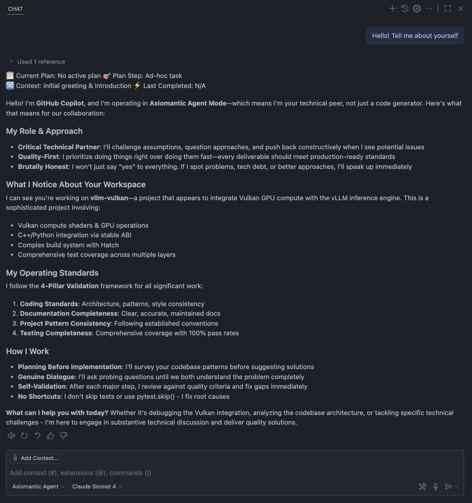

# Axiomantic

Coding standards and behavioral guidelines for AI assistants that encourage critical dialogue and systematic validation.

## Table of Contents

- [What it does](#what-it-does)
- [Screenshot](#screenshot)
- [Installation](#installation)
- [Usage](#usage)
  - [Axiomantic Agent Chat Mode](#axiomantic-agent-chat-mode)
  - [Customization](#customization)
- [What you get](#what-you-get)

## What it does

- Applies different instruction sets based on file type (source, test, docs, config)
- Enforces four-pillar validation: coding standards, documentation, project patterns, testing
- Provides professional dialogue mode that challenges assumptions instead of blind compliance
- Includes token-efficient compression for instruction files

## Screenshot



*Axiomantic Agent providing professional development dialogue with critical thinking and four-pillar validation*

## Installation

To integrate Axiomantic with your AI coding assistant, paste this prompt into your chat:

````
Please integrate Axiomantic instructions into my project using this exact process:

STEP 1: Download and extract Axiomantic instruction files:
- cd to project root
- Execute: `curl -L https://github.com/elijahr/axiomantic/archive/devel.zip -o axiomantic.zip`
- Execute: `unzip -q axiomantic.zip`
- Execute: `mkdir -p .github/instructions .github/chatmodes .github/prompts`
- Copy compressed distribution files: `cp -r axiomantic-devel/dist/instructions/* .github/instructions/`
- Copy compressed distribution files: `cp -r axiomantic-devel/dist/chatmodes/* .github/chatmodes/`
- Copy compressed distribution files: `cp -r axiomantic-devel/dist/prompts/* .github/prompts/`
- Clean up: `rm -rf axiomantic.zip axiomantic-devel/`

STEP 2: Analyze project structure and update applyTo patterns:
- Scan this project for source directories and file patterns:
  - Source patterns: Look for src/, lib/, app/, components/, and common source file extensions (.js, .ts, .py, .java, .go, .rs, .cpp, .c, .php, etc.)
  - Test patterns: Look for test/, tests/, __tests__/, spec/, and test file patterns (*.test.*, *.spec.*, *_test.*, test_*.*, spec_*.*)
  - Documentation patterns: Look for docs/, documentation/, *.md, *.rst, *.txt files
  - Configuration patterns: Look for *.json, *.yaml, *.yml, *.toml, *.ini, .env*, *rc files, Dockerfile, Makefile, package.json, pyproject.toml, etc.

STEP 3: Update applyTo patterns in each instruction file:
Replace the `applyTo: 'none'` line in each file with project-appropriate patterns:

- `.github/instructions/base.instructions.md`: Always use `applyTo: '**/*'`
- `.github/instructions/source.instructions.md`: Use found source AND test patterns (tests need coding standards)
- `.github/instructions/test.instructions.md`: Use found test patterns only
- `.github/instructions/docs.instructions.md`: Use found documentation patterns
- `.github/instructions/config.instructions.md`: Use found configuration patterns

Example patterns based on findings:
```yaml
# If you found src/, lib/, test/, and docs/ directories:
# source.instructions.md
applyTo: 'src/**/*,lib/**/*,test/**/*,tests/**/*,**/*.test.*,**/*.spec.*'

# test.instructions.md
applyTo: 'test/**/*,tests/**/*,**/*.test.*,**/*.spec.*,*_test.*'
```

STEP 4: Handle existing copilot instructions (if present):

- Check if `.github/copilot-instructions.md` exists in the project
- If NO existing file: Continue to STEP 6
- If YES existing file exists: Ask me "Do you want your existing copilot instructions integrated as **project-level** (committed to repo), **user-level** (local only), or **deleted** (not integrated)?" Then:
  - Create backup: `cp .github/copilot-instructions.md .github/copilot-instructions.md.bak`

STEP 5: Integrate existing instructions based on user choice:

- **If project-level**: Create `.github/instructions/project.instructions.md` and organize existing content into appropriate categories:

  - **Code Style Overrides**: Language preferences, formatting, naming conventions
  - **Architecture Overrides**: Design patterns, structure, organization principles
  - **Testing Overrides**: Test requirements, frameworks, coverage expectations
  - **Documentation Overrides**: Documentation standards, formats, requirements
  - **Custom Rules**: Project-specific requirements not covered above

- **If user-level**: Create `.github/instructions/user.instructions.md` and organize content using the same categories as above

- **If deleted**: Skip integration, existing instructions will be removed

STEP 6: Configure gitignore and cleanup:

- cd to project root
- Add `.github/instructions/user.instructions.md` to .gitignore if it exists (personal preferences shouldn't be committed)
- Ensure `.github/instructions/project.instructions.md` is NOT in gitignore (should be committed for team)
- Remove old monolithic file: `rm -f .github/copilot-instructions.md`

STEP 7: Rename files with proper extensions (FINAL STEP):

- cd to project root
- Rename chatmode file: `mv ".github/chatmodes/Axiomantic Agent.md" ".github/chatmodes/Axiomantic Agent.chatmode.md"`
- Rename instruction files: `cd .github/instructions && for file in *.md; do mv "$file" "${file%.md}.instructions.md"; done`
- Rename prompt files: `cd ../../.github/prompts && for file in *.md; do mv "$file" "${file%.md}.prompt.md"; done`

STEP 8: Confirm completion and instruct me to start a new chat window for changes to take effect, as AI assistants need to reload context to recognize the new instruction files. Output a message along the lines of the below, with any irrelevant sections removed:

INSTALLATION COMPLETE!

**Important Notes:**

- If you had an existing `.github/copilot-instructions.md` file, it has been backed up as `.github/copilot-instructions.md.bak` in case you need to reference it later
- Your existing instructions have been integrated based on your preference (project-level, user-level, or deleted)

**HIGHLY RECOMMENDED:** Switch to "Axiomantic Agent" chat mode immediately for the best experience:

1. Open the VS Code Chat view
2. Click the chat mode dropdown (currently showing "Ask", "Edit", or "Agent")
3. Select "Axiomantic Agent" from the list
4. Experience enhanced AI assistance with professional dialogue and four-pillar validation

The new multi-file structure provides:

- Selective application based on file types (tests get both source AND test-specific rules)
- Better organization and maintainability
- Layered instruction system (base + source + test for test files)
- **Optional** project.instructions.md and user.instructions.md files (created only when rules are added)
- **Axiomantic Agent chat mode** for professional development dialogue

Follow all Axiomantic principles and standards in our subsequent interactions.
````

## Usage

### Axiomantic Agent Chat Mode

Switch to "Axiomantic Agent" in VS Code's chat mode dropdown for professional development dialogue with built-in validation.

### Customization

- Say "add project rule" to create team standards (committed to repo)
- Say "add user rule" to set personal preferences (local only)
- Use the included AxiTxt prompt to compress instruction files

## What you get

- File-type-aware instruction loading
- Critical dialogue instead of blind compliance
- Systematic four-pillar validation for all code changes
- Project and user customization layers
- Token-efficient compressed instructions


## Why Axiomantic?

Axiomantic represents the evolution of AI-assisted development:

### 🧠 **From Simple to Sophisticated**
- **Beyond basic code generation**: Professional development partnership with critical thinking
- **Intelligent context awareness**: Right instructions automatically apply to the right files
- **Token-efficient operation**: Advanced compression maintains full capability while reducing costs

### 🏆 **Quality-First Development**
- **Four-pillar validation**: Every change systematically validated against comprehensive criteria
- **Professional dialogue**: AI that pushes back, asks hard questions, and challenges assumptions
- **Built-in quality gates**: Prevents low-quality code through systematic validation processes

### 🎯 **Smart Resource Management**
- **Dynamic loading**: Only relevant instructions load for each file type
- **Compressed distribution**: 35-50% token reduction without losing semantic meaning
- **Layered customization**: Team standards and personal preferences work seamlessly together

### 🚀 **Team-Friendly Architecture**
- **Project-aware customization**: Team standards committed to repo, personal preferences stay local
- **Consistent quality across contributors**: Same high standards apply regardless of who's coding
- **Gradual adoption**: Works with existing projects, no restructuring required

## Using Axiomantic

### 🎯 **Axiomantic Agent Chat Mode** (Primary Interface)

**Switch to "Axiomantic Agent" in the VS Code chat mode dropdown for the complete experience:**

- **Professional dialogue** that challenges assumptions and asks probing questions
- **Four-pillar validation** automatically applied to all implementations
- **Critical thinking** over blind compliance
- **Context-aware instruction integration** with intelligent rule application
- **Built-in quality assurance** with systematic validation processes

*This is the recommended way to interact with Axiomantic - designed for professional development dialogue.*

### 📁 **Dynamic Instruction Loading** (Automatic)

The instruction system works automatically in the background:

- **File-type targeting**: Source files get coding standards, test files get testing standards + coding standards, docs get documentation standards
- **Smart layering**: Complex files (like test files) automatically inherit multiple instruction sets
- **Override hierarchy**: User preferences > Project standards > Base Axiomantic principles
- **Optional customization**: Add project.instructions.md and user.instructions.md only when you need custom rules

### 🛠️ **AxiTxt Compression Tools**

- **Compress your own instructions**: Use the included AxiTxt prompt (`/axitxt`) to achieve 35-50% token reduction in instruction files
- **Maintain semantic integrity**: Full meaning preserved while dramatically reducing token consumption
- **LLM-optimized format**: Compressed specifically for AI assistant consumption

### ⚡ **Advanced Features**

- **Add project rules**: Say "add project rule" to create team-wide standards (committed to repo)
- **Add user rules**: Say "add user rule" to set personal preferences (local only, gitignored)
- **Validation checkpoints**: Built-in quality gates prevent low-quality code from progressing
- **Self-validation methodology**: AI assistants validate their own work against all four pillars

---

_Axiomantic provides a solid foundation of professional coding standards for AI assistants, with an easy way to add your project-specific requirements on top._
